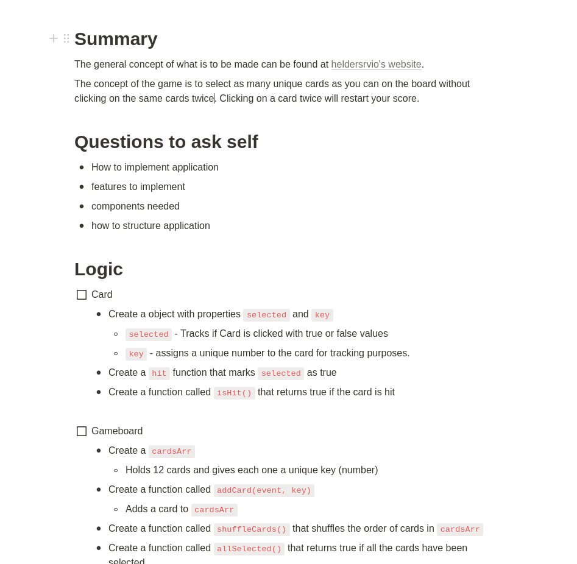

<h1 align="center">Movie Memory</h1>

<p align="center" width="100%">
    
</p>

<h4 align="center">Built for testing memory retention!</h4>
<p align="center"> <a href="https://ec-movie-memory.netlify.app/">Live >></a></p>

## Features
This app allows the user to click on a unique movie title per game. It will keep the current score and the best score
per game. There is also use of the [TMDb API](https://www.themoviedb.org/documentation/api) for getting movie covers that 
populate the game. 

## Motivation and Story
With this project I wanted to refresh my knowledge with API's and broaden my scope of using React with hooks and functional
components. As well as organizational skills needed prior to even touching code. Throughout the project there are tests created
using jest as well as dynamic item creation with React. Being able to do a nice mix of JavaScript code and React was a focal point
of this project. 

Below you can see a portion of the roadmap I made to create this project.



## Code Styles
This project follows the [Airbnb JavaScript Style Guide](https://github.com/airbnb/javascript).

Eslint and Prettier were also used in this project.

## Tech Stack
**Built with**
- [React](https://reactjs.org/)
- [Prettier](https://prettier.io/)
- [ESlint](https://eslint.org/)
- [Babel](https://babeljs.io/)
- [Webpack](https://webpack.js.org/)
- [Jest](https://jestjs.io/docs/getting-started)
- [npm](https://www.npmjs.com/)
- [react-testing-library](https://testing-library.com/docs/react-testing-library/intro/)
- [create-react-app](https://create-react-app.dev/)
- [react-responsive](https://www.npmjs.com/package/react-responsive)

## Repository Installation
```
$ git clone [redacted]
```

## Tests
All tests are run using Jest and react-testing-library.

To install Jest please follow the [Getting Started Page](https://jestjs.io/docs/getting-started) on the
Jest website.

To install react-testing-library type `npm install --save-dev @testing-library/dom` in the terminal.
To learn more please read the docs at <a href="https://testing-library.com/docs/react-testing-library/intro/">testing-library.com/react</a>

Please note, if using create-react-app - both Jest and react-testing-library will have been installed for you.

## Credits
I'd like to thank the team that created the [TMDb API](https://www.themoviedb.org/documentation/api) for letting many of us use a version of 
the API for free and I'd also like to thank my Discord Community as always, they have helped me with many questions that I have had and cleared 
up many confirmation questions as well. I couldn't do it without them.

## Contact
**Edgar Carrillo**
</br>
- [Linkedin](https://www.linkedin.com/in/ecarrillo046/)
- [Github](https://github.com/ec-rilo)


<p align="center">Project created by <a href="https://github.com/ec-rilo">Edgar Carrillo</a></p>
